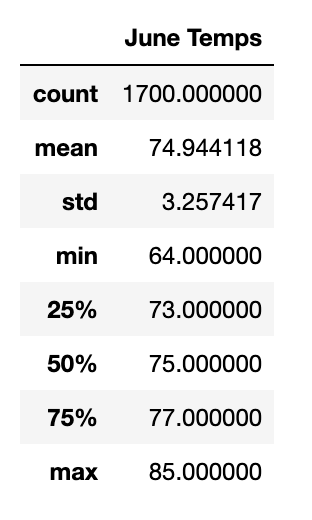
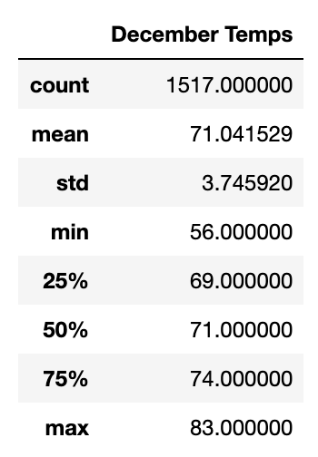
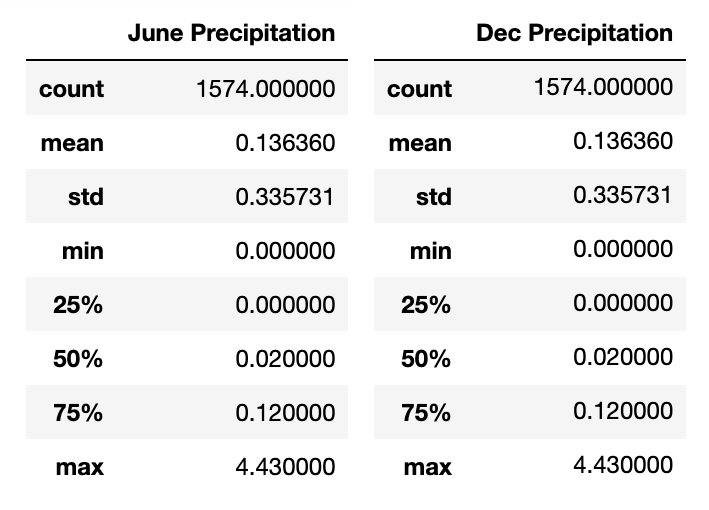

# O'ahu Surf's Up Analysis

# Overview
This analysis was done to help investors with their decision to build a shop in O'ahu, Hawaii. This analysis was focused on analyzing weather and temperature data for the city, using SQLite and Python, in the months of June and December.

# Results

The analysis done for this client included providing a summary of the temperature statistics for each month - June and December.

The below tables show the summaries for each respective month.




When comparing the temperature summaries between June and December for the city of O'ahu, there are a couple of differences between the two that should be noted.

1. The count for both months are different, by 183, which will skew the results slightly. The number of records we have included in the June dataset is 1,700 and the number of records in the summary for December is 1,517. Although the difference is not high, it is important to note.

2. The standard deviation for each month is low. June has a standard deviation of 3.25 and December has a standard deviation of 3.75, a low standard deviation means that the data is clustered closer together and that the values are reliable. The standard deviation between June and December are different by 0.5, which means that the data for June is more reliable and clustered together than December's.

3. The minimum temperatures for June and December differ by ten degrees, their maximums differ by two degrees. With these differing temperatures, the percentiles for each month vary. In June, 25% of the temperatures will be below 73 degrees, while in December 25% of the temperatures will be below 69 degrees.

# Summary

Overall based on the analysis of the temperatures from June and December, it would be a great investment for the company to open up a shop in O'ahu. The temperatures in the month for summer and winter are consistent in the mid seventies, which is a nice temperature.

To show additional analysis and support on why opening a shop in O'ahu is a good investment, the next analysis to be done is to look at the precipitation in the months of June and December. The method for analysis would be to create a summary of statistics for June is shown below, to change for December replace June with December:

```
june_rain = []
june_rain = session.query(Measurement.date, Measurement.prcp).filter(extract('month', Measurement.date)==6).all()
june_df = pd.DataFrame(june_rain, columns=['date','June Precipitation'])
june_df.set_index(df['date'], inplace=True)
june_df = june_df.sort_index()
```

The results for precipitation in both months are:



Looking at the tables, it supports the decision of investing in a shop on O'ahu. In addition to precipation, we can look further into precipation and temperature by station. An analysis would not only further support the decision, but could also provide the company a better idea of which station they could locate their shop. If a station fits their ideal rain and temperature settings, then they can pick an exact station.
