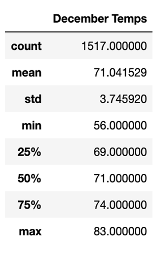

# O'ahu Surf's Up Analysis

# Overview
This analysis was done to help investors with their decision to build a shop in O'ahu, Hawaii. This analysis was focused on analyzing weather and temperature data for the city, using SQLite and Python, in the months of June and December.

# Results

The analysis done for this client included providing a summary of the temperature statistics for each month - June and December.

The below tables show the summaries for each respective month.

When comparing the temperature summaries between June and December for the city of O'ahu, there are a couple of differences between the two that should be noted.

1. The count for both months are different, by 183, which will skew the results slightly. The number of records we have included in the June dataset is 1,700 and the number of records in the summary for December is 1,517. Although the difference is not high, it is important to note.

2. The standard deviation for each month is low. June has a standard deviation of 3.25 and December has a standard deviation of 3.75, a low standard deviation means that the data is clustered closer together and that the values are reliable. The standard deviation between June and December are different by 0.5, which means that the data for June is more reliable and clustered together than December's.

3. The minimum temperatures for June and December differ by ten degrees, their maximums differ by two degrees. With these differing temperatures, the percentiles for each month vary. In June, 25% of the temperatures will be below 73 degrees, while in December 25% of the temperatures will be below 69 degrees.

# Summary
